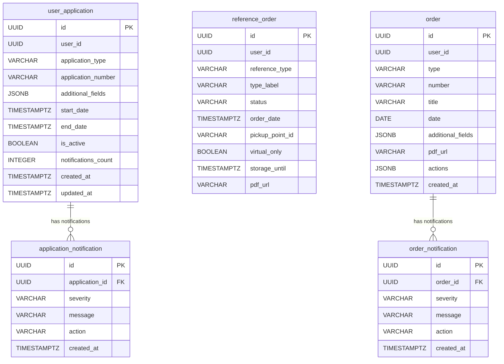
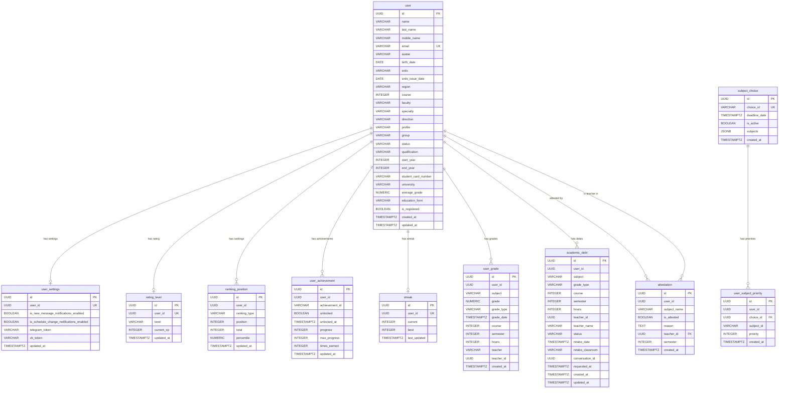
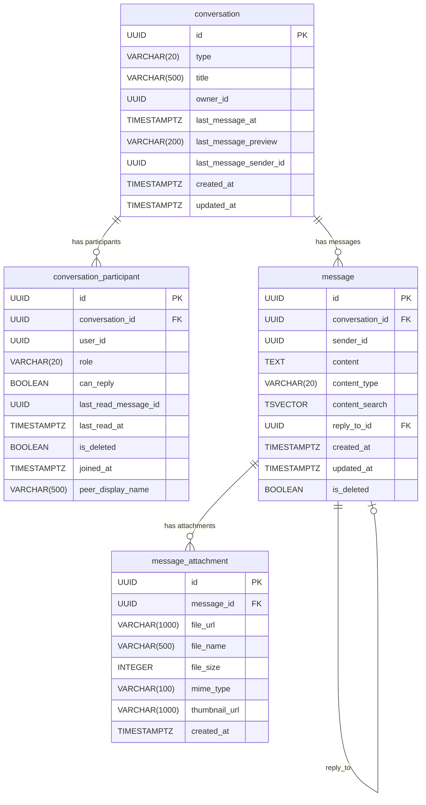
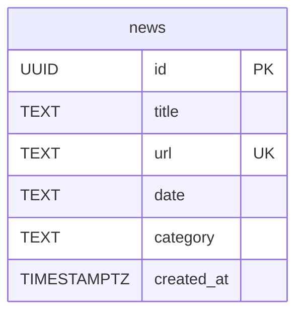
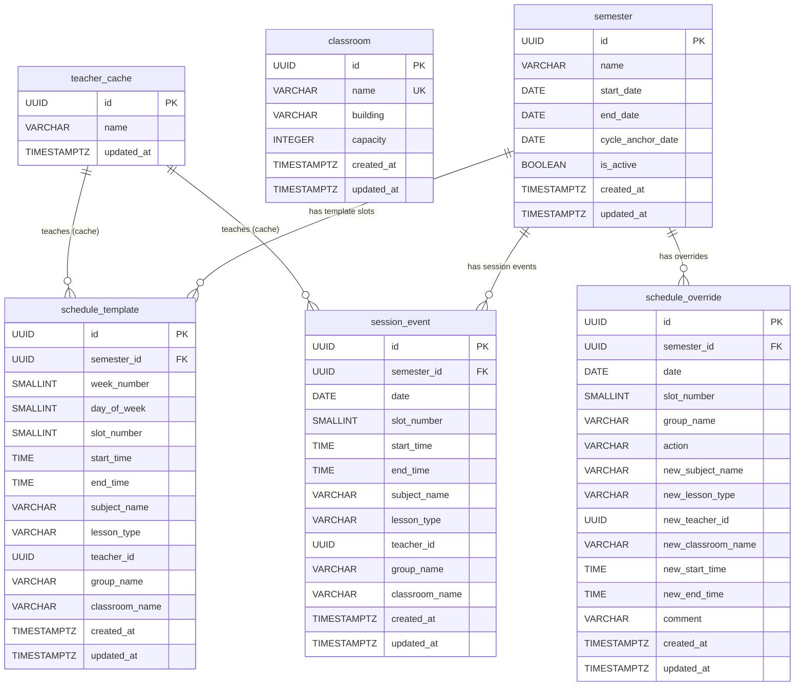

# ERD — Database Schemas

## core-auth-db

```mermaid
erDiagram
    auth_user {
        UUID id PK
        VARCHAR email UK
        VARCHAR password_hash
        VARCHAR name
        VARCHAR(20) role
        BOOLEAN is_active
        TIMESTAMPTZ created_at
        TIMESTAMPTZ updated_at
    }

    two_factor_auth {
        UUID id PK
        UUID user_id FK UK
        BOOLEAN is_enabled
        VARCHAR method
        VARCHAR secret
        VARCHAR backup_codes
        TIMESTAMPTZ verified_at
        TIMESTAMPTZ created_at
        TIMESTAMPTZ updated_at
    }

    user_session {
        UUID id PK
        UUID user_id FK
        UUID jti UK
        VARCHAR user_agent
        VARCHAR ip_address
        VARCHAR location
        VARCHAR device
        TIMESTAMPTZ created_at
        TIMESTAMPTZ expires_at
        TIMESTAMPTZ revoked_at
    }

    auth_challenge {
        UUID id PK
        UUID user_id FK
        VARCHAR(6) code
        INTEGER attempts
        TIMESTAMPTZ start_at
        TIMESTAMPTZ expiring_at
        TIMESTAMPTZ resolved_at
    }

    caldav_token {
        UUID id PK
        VARCHAR(64) token UK
        UUID user_id FK
        VARCHAR(255) device_name
        TIMESTAMPTZ created_at
        TIMESTAMPTZ revoked_at
    }

    auth_user ||--o| two_factor_auth : "has 2FA"
    auth_user ||--o{ user_session : "has sessions"
    auth_user ||--o{ auth_challenge : "has challenges"
    auth_user ||--o{ caldav_token : "has caldav tokens"
```

---

## core-applications-db

> `user_id` — логическая ссылка на `core-auth-db.auth_user.id`, FK не объявлен.



---

## core-client-info-db

> Большинство `user_id`-полей не имеют FK-ограничений. `attestation.teacher_id` — единственный FK к `user.id`.
> `academic_debt.conversation_id` — логическая ссылка на `core-messages-db.conversation.id`.



---

## core-messages-db

> `user_cache` удалена в migration 007 — заменена Redis-кешем.
> `owner_id`, `user_id`, `sender_id` — логические ссылки на `core-auth-db.auth_user.id`.



---

## core-news-db

Автономная БД, внешних связей нет.



---

## core-schedule-db

> `teacher_id` в `schedule_template`/`schedule_override`/`session_event` — логическая ссылка на `core-client-info-db.user.id`. `teacher_cache.id` зеркалит те же UUID.



---

## Связи между БД

Все межсервисные ссылки — логические (UUID без FK), целостность обеспечивается на уровне приложений.

```mermaid
erDiagram
    AUTH_USER["core-auth-db\nauth_user"] {
        UUID id PK
        VARCHAR email UK
    }

    CLIENT_USER["core-client-info-db\nuser"] {
        UUID id PK
        VARCHAR email UK
        BOOLEAN is_registered
    }

    APP_USER_APPLICATION["core-applications-db\nuser_application"] {
        UUID user_id
    }
    APP_REFERENCE_ORDER["core-applications-db\nreference_order"] {
        UUID user_id
    }
    APP_ORDER["core-applications-db\norder"] {
        UUID user_id
    }

    MSG_CONVERSATION["core-messages-db\nconversation"] {
        UUID owner_id
        UUID last_message_sender_id
    }
    MSG_PARTICIPANT["core-messages-db\nconversation_participant"] {
        UUID user_id
    }
    MSG_MESSAGE["core-messages-db\nmessage"] {
        UUID sender_id
    }

    SCH_TEACHER_CACHE["core-schedule-db\nteacher_cache"] {
        UUID id PK
    }
    SCH_TEMPLATE["core-schedule-db\nschedule_template"] {
        UUID teacher_id
    }
    SCH_SESSION["core-schedule-db\nsession_event"] {
        UUID teacher_id
    }

    CLIENT_DEBT["core-client-info-db\nacademic_debt"] {
        UUID user_id
        UUID teacher_id
        UUID conversation_id
    }

    AUTH_USER ||--|| CLIENT_USER : "email (logical)"

    AUTH_USER ||--o{ APP_USER_APPLICATION : "user_id (logical)"
    AUTH_USER ||--o{ APP_REFERENCE_ORDER : "user_id (logical)"
    AUTH_USER ||--o{ APP_ORDER : "user_id (logical)"

    AUTH_USER ||--o{ MSG_CONVERSATION : "owner_id (logical)"
    AUTH_USER ||--o{ MSG_PARTICIPANT : "user_id (logical)"
    AUTH_USER ||--o{ MSG_MESSAGE : "sender_id (logical)"

    CLIENT_USER ||--o| SCH_TEACHER_CACHE : "id mirrors (sync)"
    CLIENT_USER ||--o{ SCH_TEMPLATE : "teacher_id (logical)"
    CLIENT_USER ||--o{ SCH_SESSION : "teacher_id (logical)"

    CLIENT_USER ||--o{ CLIENT_DEBT : "user_id (logical)"
    CLIENT_USER ||--o{ CLIENT_DEBT : "teacher_id (logical)"

    MSG_CONVERSATION ||--o| CLIENT_DEBT : "conversation_id (logical)"
```

### Таблица межсервисных зависимостей

| Откуда                                      | Поле              | Куда                            | Тип связи          |
| ------------------------------------------- | ----------------- | ------------------------------- | ------------------ |
| `core-auth-db.auth_user`                    | `email`           | `core-client-info-db.user`      | логическая, 1:1    |
| `core-applications-db.user_application`     | `user_id`         | `core-auth-db.auth_user`        | логическая, N:1    |
| `core-applications-db.reference_order`      | `user_id`         | `core-auth-db.auth_user`        | логическая, N:1    |
| `core-applications-db.order`                | `user_id`         | `core-auth-db.auth_user`        | логическая, N:1    |
| `core-messages-db.conversation`             | `owner_id`        | `core-auth-db.auth_user`        | логическая, N:1    |
| `core-messages-db.conversation_participant` | `user_id`         | `core-auth-db.auth_user`        | логическая, N:1    |
| `core-messages-db.message`                  | `sender_id`       | `core-auth-db.auth_user`        | логическая, N:1    |
| `core-schedule-db.teacher_cache`            | `id`              | `core-client-info-db.user`      | синхронизация, 1:1 |
| `core-schedule-db.schedule_template`        | `teacher_id`      | `core-client-info-db.user`      | логическая, N:1    |
| `core-schedule-db.session_event`            | `teacher_id`      | `core-client-info-db.user`      | логическая, N:1    |
| `core-client-info-db.academic_debt`         | `teacher_id`      | `core-client-info-db.user`      | логическая, N:1    |
| `core-client-info-db.academic_debt`         | `conversation_id` | `core-messages-db.conversation` | логическая, N:1    |
