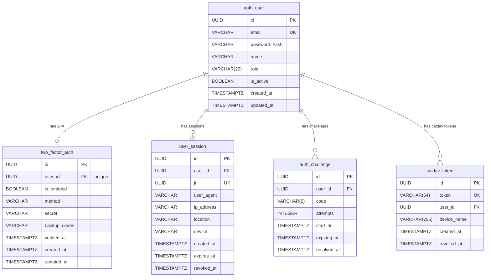
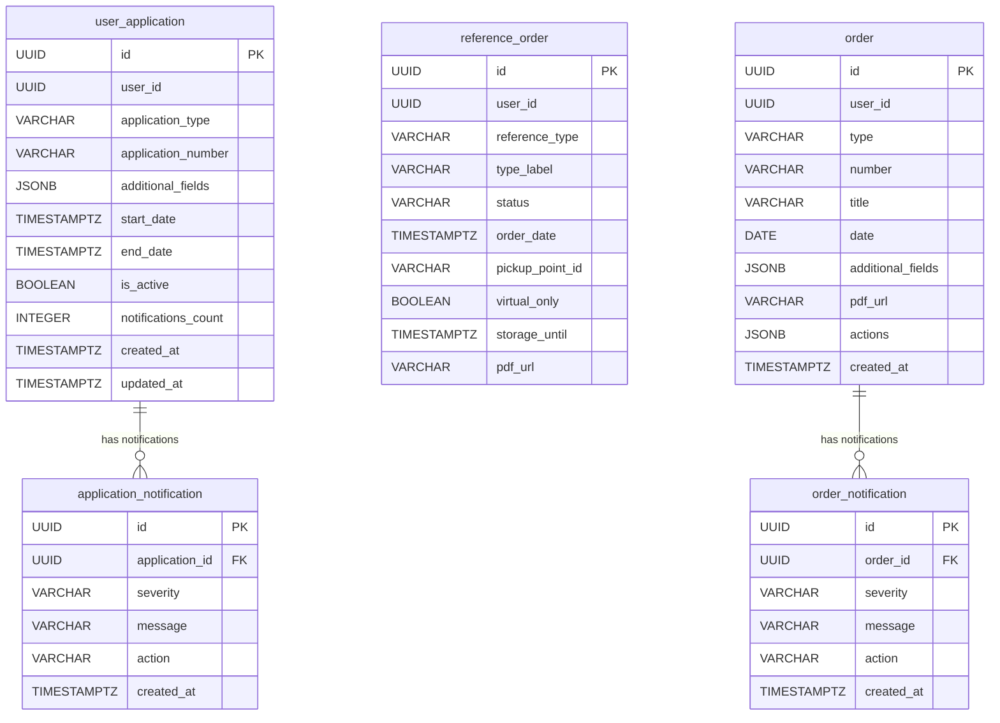
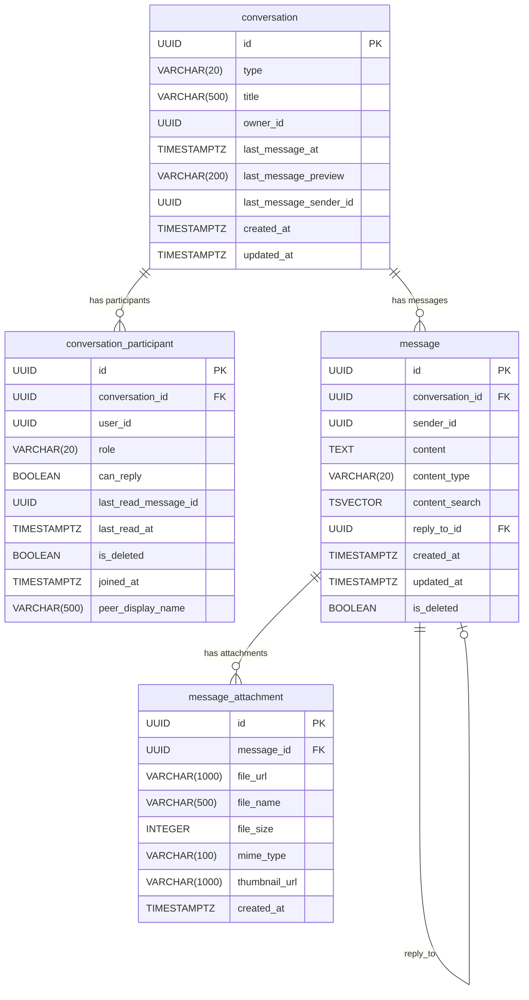
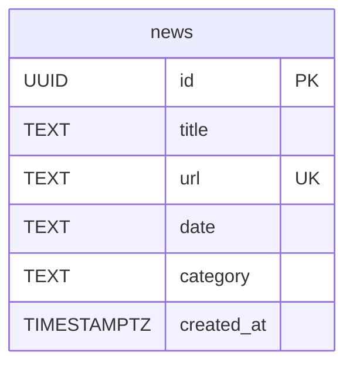
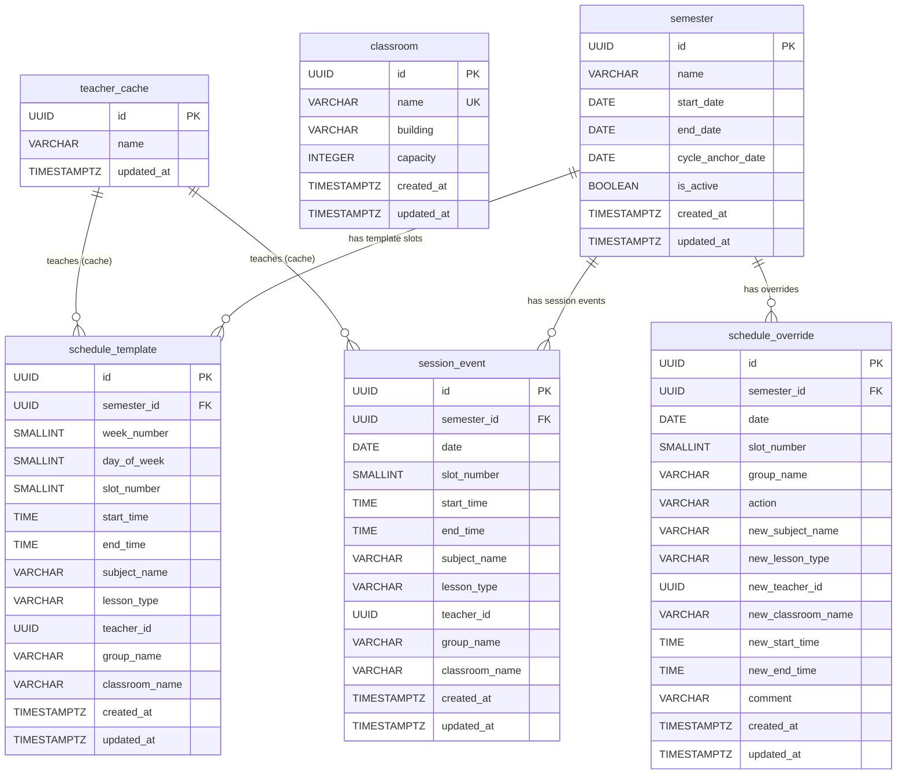
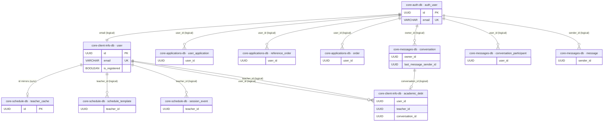

# ERD — Database Schemas

## core-auth-db

### Описание таблиц

**`auth_user`** — единственный источник правды по учётным данным. Все остальные сервисы идентифицируют пользователя по `id` из этой таблицы.

- `role`: `student` | `teacher` | `admin` | `moderator`
- `is_active` — мягкое отключение аккаунта без удаления

**`two_factor_auth`** — конфигурация 2FA (1:1 с пользователем). Запись создаётся при включении 2FA, `is_enabled` может оставаться `false` до верификации.

- `method`: `totp` | `sms` | `email`
- `secret` — TOTP-секрет в формате base32
- `backup_codes` — JSON-массив одноразовых резервных кодов

**`user_session`** — каждая запись соответствует одному выданному JWT-токену. Используется для листинга активных сессий и отзыва токенов.

- `jti` — JWT ID из payload токена; проверяется при валидации сессии
- `revoked_at` — мягкий логаут без удаления записи
- `location` / `device` — вычисляются при логине из IP и User-Agent

**`auth_challenge`** — временный OTP-код для 2FA-флоу.

- `code` — 6-значный код
- `attempts` — счётчик неверных попыток (защита от брутфорса)
- `expiring_at` — TTL кода; `resolved_at` — проставляется при успешном вводе

**`caldav_token`** — долгоживущие токены для подписки на расписание через CalDAV. Передаются в URL, не требуют JWT.

- `token` — случайная строка 64 символа
- `revoked_at` — отзыв без удаления строки

---

## core-applications-db

> `user_id` — логическая ссылка на `core-auth-db.auth_user.id`, FK не объявлен.

### Описание таблиц

**`user_application`** — заявление студента (академический отпуск, перевод, справка и т.д.).

- `application_type` — тип заявления (строковый код)
- `application_number` — номер в системе документооборота
- `additional_fields` (JSONB) — произвольные поля, специфичные для типа заявления
- `notifications_count` — денормализованный счётчик непрочитанных уведомлений

**`application_notification`** — уведомление об изменении статуса заявления.

- `severity`: `info` | `warning` | `error`
- `action` — ссылка или действие, предлагаемое пользователю

**`reference_order`** — заказ официальной справки (об обучении, с места учёбы и т.д.).

- `status`: `preparation` | `ready` | `issued`
- `pickup_point_id` — точка выдачи справки
- `virtual_only` — только электронный вариант без бумажного
- `storage_until` — срок хранения до выдачи; `pdf_url` — ссылка на PDF

**`order`** — приказ деканата, затрагивающий студента (зачисление, отчисление, перевод).

- `additional_fields` (JSONB) — произвольные реквизиты приказа
- `actions` (JSONB) — список доступных действий студента по данному приказу

**`order_notification`** — уведомление о появлении нового приказа или изменении существующего.

---

## core-client-info-db

> Большинство `user_id`-полей не имеют FK-ограничений. `attestation.teacher_id` — единственный FK к `user.id`.
> `academic_debt.conversation_id` — логическая ссылка на `core-messages-db.conversation.id`.

### Описание таблиц

**`user`** — профиль студента или преподавателя. Хранит личные и учебные данные.

- Личные: `snils`, `birth_date`, `region`, `avatar`
- Учебные: `course`, `faculty`, `specialty`, `direction`, `profile`, `group`, `qualification`, `education_form`
- `status` — текущий статус (`Обучается (Бюджет)`, `Преподаватель` и т.д.)
- `is_registered` — `false` если пользователь ещё не создал аккаунт в `core-auth`; используется в регистрационном флоу по СНИЛС

**`user_settings`** — настройки уведомлений (1:1 с `user`).

- `telegram_token` / `vk_token` — токены для push-уведомлений через мессенджеры

**`rating_level`** — уровень геймификации пользователя (1:1).

- `level`: `beginner` | `intermediate` | `advanced` | ...
- `current_xp` — текущий опыт внутри уровня

**`ranking_position`** — позиция в рейтинге по разным срезам. Одна строка на каждую комбинацию `(user, ranking_type)`.

- `ranking_type`: `byGrade`, `byAttendanceCourse`, `byAttendanceFaculty`, `byAttendanceUniversity` и т.д.
- `percentile` — процентиль (топ-X%)

**`user_achievement`** — прогресс по достижениям.

- `achievement_id` — строковый идентификатор ачивки
- `progress` / `max_progress` — прогресс до разблокировки
- `times_earned` — счётчик для повторяемых ачивок

**`streak`** — серия активностей (1:1 с пользователем).

- `current` — текущая непрерывная серия; `best` — лучшая за всё время

**`user_grade`** — оценка студента за предмет.

- `grade_type`: `exam` | `credit` | `differential_credit`
- `teacher` — ФИО преподавателя (денормализованная строка, заполняется всегда)
- `teacher_id` — UUID преподавателя (добавлен в migration 008, может быть `NULL` для старых записей)

**`subject_choice`** — сессия выбора дисциплин по выбору.

- `subjects` (JSONB) — список доступных предметов
- `deadline_date` — срок подачи приоритетов; `is_active` — открыта ли запись

**`user_subject_priority`** — предпочтения студента в рамках конкретной сессии выбора.

- `priority` — порядковый номер предпочтения (1 = первый выбор)

**`academic_debt`** — академическая задолженность студента.

- `status`: `pending` → `requested` → `scheduled` → `resolved`
- `conversation_id` — ссылка на чат с преподавателем в `core-messages-db`; создаётся при переходе в `requested`
- `teacher_name` — денормализованное ФИО (на случай если `teacher_id` изменится)

**`attestation`** — промежуточная аттестация студента по предмету за семестр.

- `is_attested` — прошёл / не прошёл
- `reason` — обязателен при `is_attested = false` (CHECK-constraint в БД)
- `teacher_id` — единственный FK в этой БД, ссылается на `user.id`

---

## core-messages-db

> `user_cache` удалена в migration 007 — заменена Redis-кешем.
> `owner_id`, `user_id`, `sender_id` — логические ссылки на `core-auth-db.auth_user.id`.

### Описание таблиц

**`conversation`** — диалог или групповой чат.

- `type`: `direct` | `group` | `channel`
- `last_message_at` / `last_message_preview` / `last_message_sender_id` — денормализованные поля для быстрого рендера списка чатов без JOIN

**`conversation_participant`** — участник чата. Одна запись на каждую пару `(conversation, user)`.

- `role`: `member` | `admin`
- `can_reply` — в каналах может быть `false` (режим read-only)
- `last_read_message_id` / `last_read_at` — для подсчёта непрочитанных
- `is_deleted` — мягкое удаление (пользователь покинул чат)
- `peer_display_name` — кешированное имя собеседника в личных чатах

**`message`** — сообщение в чате.

- `content_type`: `text` | `image` | ...
- `content_search` (TSVECTOR) — заполняется триггером `messages_search_trigger` автоматически, используется для full-text поиска на русском языке
- `reply_to_id` — ссылка на цитируемое сообщение (self-join, `ON DELETE SET NULL`)
- `is_deleted` — мягкое удаление сообщения

**`message_attachment`** — вложение к сообщению.

- `mime_type` — определяет тип превью на клиенте
- `thumbnail_url` — уменьшенная версия для изображений и видео

---

## core-news-db

Автономная БД, внешних связей нет.

### Описание таблиц

**`news`** — новость университета, агрегированная с внешнего сайта.

- `url` — уникален, защищает от дублей при повторном парсинге (`ON CONFLICT DO NOTHING`)
- `date` — строка в оригинальном формате источника (не `DATE`, так как формат нестабилен)
- `category` — рубрика (`Образование`, `Наука`, `Индустрия`, `Международное` и т.д.)

---

## core-schedule-db

> `teacher_id` в `schedule_template`/`schedule_override`/`session_event` — логическая ссылка на `core-client-info-db.user.id`. `teacher_cache.id` зеркалит те же UUID.

### Описание таблиц

**`teacher_cache`** — локальная копия имён преподавателей из `core-client-info-db`. UUID совпадает с `user.id`. Обновляется при изменении профиля преподавателя, чтобы сервис расписания не делал cross-service запросы при каждом рендере.

**`classroom`** — аудитория.

- `building` — корпус; `capacity` — вместимость

**`semester`** — учебный семестр.

- `cycle_anchor_date` — дата начала отсчёта двухнедельного цикла; используется для вычисления номера недели по конкретной дате
- `is_active` — в каждый момент активен ровно один семестр

**`schedule_template`** — одна пара в двухнедельном шаблоне расписания. Фактическое расписание на конкретную дату строится из шаблона с учётом `schedule_override`.

- `week_number`: `1` | `2` — номер недели в двухнедельном цикле
- `day_of_week`: `0`–`5` — пн–сб
- `slot_number`: `1`–`8` — номер пары
- Уникальность: `(semester_id, week_number, day_of_week, slot_number, group_name)`

**`schedule_override`** — исключение из шаблона на конкретную дату (отмена, перенос, замена преподавателя).

- `action`: `cancel` | `replace` | `add`
- Поля `new_*` заполняются только при `replace` / `add`; при `cancel` — NULL

**`session_event`** — событие сессии (экзамен, зачёт, консультация). Не привязано к шаблону, хранится отдельно от обычного расписания.

---

## Связи между БД

Все межсервисные ссылки — логические (UUID без FK), целостность обеспечивается на уровне приложений.

### Таблица межсервисных зависимостей

| Откуда                                      | Поле              | Куда                            | Тип связи          |
| ------------------------------------------- | ----------------- | ------------------------------- | ------------------ |
| `core-auth-db.auth_user`                    | `email`           | `core-client-info-db.user`      | логическая, 1:1    |
| `core-applications-db.user_application`     | `user_id`         | `core-auth-db.auth_user`        | логическая, N:1    |
| `core-applications-db.reference_order`      | `user_id`         | `core-auth-db.auth_user`        | логическая, N:1    |
| `core-applications-db.order`                | `user_id`         | `core-auth-db.auth_user`        | логическая, N:1    |
| `core-messages-db.conversation`             | `owner_id`        | `core-auth-db.auth_user`        | логическая, N:1    |
| `core-messages-db.conversation_participant` | `user_id`         | `core-auth-db.auth_user`        | логическая, N:1    |
| `core-messages-db.message`                  | `sender_id`       | `core-auth-db.auth_user`        | логическая, N:1    |
| `core-schedule-db.teacher_cache`            | `id`              | `core-client-info-db.user`      | синхронизация, 1:1 |
| `core-schedule-db.schedule_template`        | `teacher_id`      | `core-client-info-db.user`      | логическая, N:1    |
| `core-schedule-db.session_event`            | `teacher_id`      | `core-client-info-db.user`      | логическая, N:1    |
| `core-client-info-db.academic_debt`         | `teacher_id`      | `core-client-info-db.user`      | логическая, N:1    |
| `core-client-info-db.academic_debt`         | `conversation_id` | `core-messages-db.conversation` | логическая, N:1    |
