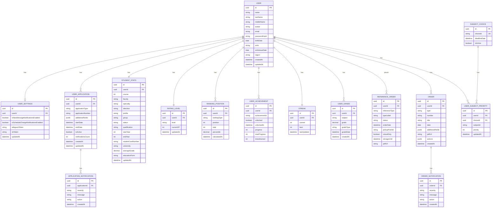

# Структура данных пользователя

## ERD диаграмма базы данных



## Описание сущностей и где они используются

### USER

**Описание:** Основная информация о пользователе  
**Используется в:**

- Главная страница профиля (`/profile`) - отображение имени, фамилии, аватара
- Страница личных данных (`/profile/data`) - отображение ФИО, даты рождения, СНИЛС, региона
- Все страницы - навигационная панель с аватаром

### USER_SETTINGS

**Описание:** Настройки пользователя и токены для SSO  
**Используется в:**

- Страница настроек (`/profile/settings`) - управление уведомлениями
- Авторизация через Telegram/VK - хранение токенов для SSO

### USER_APPLICATION

**Описание:** Универсальная таблица для заявлений/договоров (стипендия, общежитие и др.)  
**Используется в:**

- Главная страница профиля (`/profile`) - карточки "Стипендия" и "Общежитие"
- Страница общежития (`/profile/dormitory`) - информация о договоре
- `applicationType` может быть: `scholarship`, `dormitory`, и другие типы заявлений
- `additionalFields` для стипендии: `{ amount: decimal, currency: string }`
- `additionalFields` для общежития: `{ contractNumber: string, dormitoryName: string, address: string, roomNumber: string }`

### APPLICATION_NOTIFICATION

**Описание:** Уведомления по заявлениям/договорам  
**Используется в:**

- Страница общежития (`/profile/dormitory`) - список уведомлений (задолженности, документы)
- Главная страница профиля - счетчик уведомлений на карточках

### STUDENT_STATS

**Описание:** Статистика и академическая информация студента  
**Используется в:**

- Страница рейтинга (`/profile/rating`) - отображение курса, факультета, специальности, среднего балла, формы обучения
- Страница личных данных (`/profile/data`) - отображение учебного заведения, факультета, специальности, направления, профиля, группы, статуса, квалификации, курса, годов обучения, номера студенческого билета

### RATING_LEVEL

**Описание:** Уровень студента в рейтинговой системе  
**Используется в:**

- Страница рейтинга (`/profile/rating`) - прогресс-бар уровня
- Расчет title, color, nextLevelXP происходит на основе `level` и конфигурации из JSON

### RANKING_POSITION

**Описание:** Позиции в различных рейтингах  
**Используется в:**

- Страница рейтинга (`/profile/rating`) - карточки с позициями по курсу, факультету, университету, специальности, посещаемости
- `rankingType`: `byCourse`, `byFaculty`, `byUniversity`, `bySpecialty`, `byAttendance`

### USER_ACHIEVEMENT

**Описание:** Достижения пользователя (хранится только ID, статика в JSON)  
**Используется в:**

- Страница рейтинга (`/profile/rating`) - сетка достижений
- `achievementId` ссылается на конфигурацию в JSON (title, description, icon берутся оттуда)

### STREAK

**Описание:** Серия дней без пропусков  
**Используется в:**

- Страница рейтинга (`/profile/rating`) - карточка "Серия без пропусков"

### USER_GRADE

**Описание:** Все оценки пользователя  
**Используется в:**

- Страница рейтинга (`/profile/rating`) - расчет среднего балла, отображение последних улучшений
- Расчет XP для уровня
- `gradeType`: `exam`, `test`, `coursework`, `lab`, etc.

### REFERENCE_ORDER

**Описание:** Заказы справок  
**Используется в:**

- Страница справок (`/profile/references`) - история заказов, форма заказа
- `pickupPointId` ссылается на конфигурацию точки выдачи в JSON

### SUBJECT_CHOICE

**Описание:** Выборы дисциплин с дедлайнами  
**Используется в:**

- Страница дисциплин по выбору (`/subjects/ranking`) - отображение дедлайна
- `choiceId` ссылается на группу дисциплин в JSON (например, `math`, `physics`, `programming`)

### USER_SUBJECT_PRIORITY

**Описание:** Приоритеты дисциплин пользователя  
**Используется в:**

- Страница дисциплин по выбору (`/subjects/ranking`) - сохранение и отображение порядка дисциплин
- `subjectId` ссылается на конкретную дисциплину в JSON

### ORDER

**Описание:** Приказы студента (о зачислении, стипендии, общежитии и др.)  
**Используется в:**

- Страница приказов (`/profile/orders`) - список всех приказов с фильтрацией по типам
- `type` может быть: `dormitory` (общежитие), `scholarship` (стипендия), `education` (обучение), `general` (общий)
- Обязательные поля: `title` (название), `number` (номер), `date` (дата приказа)
- `additionalFields` - объект с дополнительными полями приказа (Record<string, string>), где ключи - это i18n ключи для отображения лейблов:
  - `order.field.comment` - комментарий к приказу
  - `order.field.startDate` - дата начала действия
  - `order.field.endDate` - дата окончания действия
  - `order.field.educationForm` - форма обучения
  - `order.field.educationType` - тип обучения
  - `order.field.direction` - направление/специальность
  - `order.field.faculty` - факультет
  - `order.field.course` - курс
  - `order.field.group` - группа
  - `order.field.qualification` - квалификация
- `pdfUrl` - ссылка на скачивание приказа в формате PDF (deprecated, используйте `actions`)
- `actions` - объект с действиями для приказа:
  - `primary` - основное действие (например, скачивание PDF):
    - `title` - текст кнопки
    - `action` - URL или deeplink для выполнения действия
  - `secondary` - дополнительное действие (опционально):
    - `title` - текст кнопки
    - `action` - URL или deeplink для выполнения действия

### ORDER_NOTIFICATION

**Описание:** Уведомления по приказам  
**Используется в:**

- Страница приказов (`/profile/orders`) - отображение уведомлений в деталке приказа
- Карточки приказов - badge с количеством уведомлений
- `severity`: `error`, `info`, `success`, `warning`
- `action` может содержать deeplink или URL для перехода

## API Endpoints

### Профиль пользователя

#### `GET /api/profile/user`

Получение основной информации о пользователе (имя, фамилия, отчество, аватар)

#### `GET /api/profile/applications`

Получение заявлений/договоров пользователя (стипендия, общежитие)

**Query параметры:**

- `type` (optional) - фильтр по типу заявления (`scholarship`, `dormitory`, etc.)
- `id` (optional) - получение конкретного заявления по ID

**Примеры:**

- `GET /api/profile/applications` - все заявления
- `GET /api/profile/applications?type=dormitory` - только общежитие
- `GET /api/profile/applications?id=uuid` - конкретное заявление

#### `GET /api/profile/notifications`

Получение уведомлений пользователя

**Query параметры:**

- `type` (optional) - фильтр по типу заявления (`scholarship`, `dormitory`, etc.)
- `applicationId` (optional) - фильтр по конкретному заявлению

**Примеры:**

- `GET /api/profile/notifications` - все уведомления
- `GET /api/profile/notifications?type=dormitory` - уведомления по общежитию
- `GET /api/profile/notifications?applicationId=uuid` - уведомления по конкретному заявлению

### Общежитие

#### `POST /api/dormitory/parent-agreement`

Загрузка согласия родителей

### Настройки

#### `GET /api/settings`

Получение настроек пользователя

#### `PUT /api/settings`

Обновление настроек пользователя (уведомления, SSO токены и др.)

**Body:**

```json
{
  "isNewMessageNotificationsEnabled": true,
  "isScheduleChangeNotificationsEnabled": false,
  "telegramToken": "optional_token",
  "vkToken": "optional_token"
}
```

#### `POST /api/settings/email`

Смена email пользователя с поддержкой 2FA

**Body (первый запрос):**

```json
{
  "newEmail": "new@example.com"
}
```

**Response (если нужна 2FA):**

```json
{
  "status": "need2fa",
  "message": "Код подтверждения отправлен на текущий email"
}
```

**Body (повторный запрос с кодом):**

```json
{
  "newEmail": "new@example.com",
  "confirmationCode": "123456"
}
```

**Response (успех):**

```json
{
  "status": "success"
}
```

#### `POST /api/settings/password`

Смена пароля пользователя с поддержкой 2FA

**Body (первый запрос):**

```json
{
  "currentPassword": "old_password",
  "newPassword": "new_password"
}
```

**Response (если нужна 2FA):**

```json
{
  "status": "need2fa",
  "message": "Код подтверждения отправлен на ваш email"
}
```

**Body (повторный запрос с кодом):**

```json
{
  "currentPassword": "old_password",
  "newPassword": "new_password",
  "confirmationCode": "123456"
}
```

**Response (успех):**

```json
{
  "status": "success"
}
```

### Рейтинг

#### `GET /api/rating/stats`

Получение статистики студента (курс, факультет, специальность, средний балл, форма обучения)

#### `GET /api/rating/level`

Получение информации об уровне студента

#### `GET /api/rating/rankings`

Получение позиций в рейтингах (по курсу, факультету, университету, специальности, посещаемости)

#### `GET /api/rating/achievements`

Получение достижений пользователя

#### `GET /api/rating/streak`

Получение информации о серии без пропусков

#### `GET /api/rating/grades`

Получение оценок пользователя (с возможностью фильтрации по периоду)

#### `GET /api/rating/grade-improvements`

Получение последних улучшений оценок (вычисляется на основе USER_GRADE)

### Справки

#### `GET /api/references`

Получение списка заказанных справок

#### `GET /api/references/:id`

Получение детальной информации о справке по ID

**Response:**

```json
{
  "id": "uuid",
  "referenceType": "rdzd",
  "typeLabel": "РЖД",
  "status": "ready",
  "orderDate": "2025-01-28T00:00:00Z",
  "pickupPointId": "spbkt_hr",
  "virtualOnly": false,
  "storageUntil": "2025-02-14T00:00:00Z",
  "pdfUrl": "/api/references/uuid/pdf"
}
```

#### `POST /api/references/order`

Заказ новой справки

**Body:**

```json
{
  "referenceType": "rdzd",
  "pickupPointId": "spbkt_hr",
  "virtualOnly": false
}
```

#### `POST /api/references/:id/cancel`

Отмена заказа справки

#### `POST /api/references/:id/extend-storage`

Продление срока хранения справки

#### `GET /api/references/:id/pdf`

Получение PDF-файла справки

### Дисциплины по выбору

#### `GET /api/subjects/choices`

Получение активных выборов дисциплин с дедлайнами

#### `GET /api/subjects/user-priorities/:choiceId`

Получение приоритетов дисциплин пользователя для конкретного выбора

#### `POST /api/subjects/save-priorities`

Сохранение приоритетов дисциплин

### Личные данные

#### `GET /api/profile/personal-data`

Получение личных данных пользователя (ФИО, дата рождения, СНИЛС, регион) и академической информации (учебное заведение, факультет, специальность, направление, профиль, группа, статус, квалификация, курс, годы обучения, номер студенческого билета)

**Response:**

```json
{
  "user": {
    "name": "Всеволод",
    "lastName": "Булгаков",
    "middleName": "Денисович",
    "avatar": "https://example.com/avatar.jpg",
    "birthDate": "2005-12-10",
    "snils": "123-456-789 00",
    "snilsIssueDate": "2009-01-13",
    "region": "Санкт-Петербург"
  },
  "academicInfo": [
    { "label": "Учебное заведение", "value": "Университет телекоммуникаций" },
    { "label": "Факультет", "value": "Информационных технологий и программной инженерии (ИТПИ)" },
    { "label": "Специальность/направление", "value": "09.03.04 - Программная инженерия" },
    { "label": "Форма обучения", "value": "Очная" },
    { "label": "Квалификация", "value": "Бакалавр" },
    {
      "label": "Профиль",
      "value": "Разработка программного обеспечения и приложений искусственного интеллекта в киберфизических системах"
    },
    { "label": "Группа", "value": "ИКПИ-25" },
    { "label": "Статус", "value": "Обучается (Бюджет)" },
    { "label": "Курс", "value": "4" },
    { "label": "Год начала обучения", "value": "2022" },
    { "label": "Год окончания обучения", "value": "2026" },
    { "label": "Студенческий билет", "value": "№ 9900001" }
  ]
}
```

### Приказы

#### `GET /api/orders`

Получение списка приказов пользователя

**Query параметры:**

- `type` (optional) - фильтр по типу приказа (может быть несколько через запятую: `dormitory,scholarship`)
- `offset` (optional, default: 0) - смещение для пагинации
- `limit` (optional, default: 20) - количество приказов на страницу

**Примеры:**

- `GET /api/orders` - все приказы (первые 20)
- `GET /api/orders?type=dormitory` - только приказы по общежитию
- `GET /api/orders?type=dormitory,scholarship` - приказы по общежитию и стипендии
- `GET /api/orders?offset=20&limit=20` - следующие 20 приказов

**Response:**

```json
{
  "orders": [
    {
      "id": "uuid",
      "type": "scholarship",
      "number": "250/кс",
      "title": "Назначить стипендию",
      "date": "2026-02-18",
      "comment": "№250/кс от 18.02.2026\nГАС ИТПИ 2 сем 25/26",
      "startDate": "2026-02-01",
      "endDate": "2026-04-30",
      "educationForm": "Очная",
      "educationType": "Бюджет",
      "direction": "09.03.04 - Программная инженерия",
      "faculty": "ИТПИ",
      "course": "4",
      "group": "ИКПИ-25",
      "qualification": "Бакалавр",
      "pdfUrl": "/api/orders/uuid/pdf",
      "notificationsCount": 1
    }
  ],
  "total": 200,
  "hasMore": true
}
```

#### `GET /api/orders/counts`

Получение количества приказов по типам

**Response:**

```json
{
  "dormitory": 50,
  "scholarship": 50,
  "education": 50,
  "general": 50
}
```

#### `GET /api/orders/:id`

Получение детальной информации о приказе по ID

**Response:**

```json
{
  "id": "uuid",
  "type": "scholarship",
  "number": "250/кс",
  "title": "Назначить стипендию",
  "date": "2026-02-18",
  "comment": "№250/кс от 18.02.2026\nГАС ИТПИ 2 сем 25/26",
  "startDate": "2026-02-01",
  "endDate": "2026-04-30",
  "educationForm": "Очная",
  "educationType": "Бюджет",
  "direction": "09.03.04 - Программная инженерия",
  "faculty": "ИТПИ",
  "course": "4",
  "group": "ИКПИ-25",
  "qualification": "Бакалавр",
  "pdfUrl": "/api/orders/uuid/pdf",
  "notifications": [
    {
      "severity": "info",
      "message": "Стипендия будет начислена 15 числа",
      "action": null
    }
  ]
}
```

#### `GET /api/orders/:id/pdf`

Получение PDF-файла приказа

## Константы для вынесения в JSON базу

Следующие константы влияют на отображение и должны быть вынесены в общую JSON базу для кэширования.

**Структура JSON базы:**

```
/cdn/static-data/
  ├── achievements.json          # Конфигурация достижений
  ├── rating-levels.json         # Конфигурация уровней рейтинга
  ├── reference-types.json       # Типы справок
  ├── pickup-points.json         # Точки выдачи справок
  ├── subject-choices.json       # Группы дисциплин и доступные дисциплины
  └── onboarding-tours.json      # Конфигурация туров для онбординга
```

### Уровни рейтинга

**Файл:** `services/web-profile-ssr/src/entities/Rating/levelConfig.ts`

```typescript
export const LEVEL_CONFIGS: Record<StudentLevel, { title: string; minXP: number; color: string }> = {
  novice: { title: "Новичок", minXP: 0, color: "#9E9E9E" },
  beginner: { title: "Начинающий", minXP: 100, color: "#8BC34A" },
  intermediate: { title: "Продвинутый", minXP: 300, color: "#2196F3" },
  advanced: { title: "Опытный", minXP: 600, color: "#9C27B0" },
  expert: { title: "Эксперт", minXP: 1000, color: "#FF9800" },
  master: { title: "Мастер", minXP: 1500, color: "#F44336" },
  legend: { title: "Легенда", minXP: 2500, color: "#D4AF37" },
};
```

### Конфигурация достижений

**Файл:** `services/web-profile-ssr/src/entities/Rating/achievementsConfig.ts`

```typescript
export const ACHIEVEMENT_CONFIGS: Record<
  AchievementType,
  Omit<Achievement, "unlocked" | "unlockedAt" | "progress" | "maxProgress" | "timesEarned">
> = {
  excellent_student: { id: "excellent_student", title: "Отличник", description: "Средний балл 4.6 и выше", icon: "🏆" },
  unstoppable: {
    id: "unstoppable",
    title: "Неудержимый",
    description: "Вошёл в топ 10% по посещаемости за всё время",
    icon: "🔥",
  },
  top_1_percent: { id: "top_1_percent", title: "Топ 1%", description: "Вошёл в топ 1% по университету", icon: "👑" },
  first_try: { id: "first_try", title: "С первого раза", description: "Сдал все экзамены с первого раза", icon: "🎯" },
  perfectionist: { id: "perfectionist", title: "Перфекционист", description: "Средний балл 5.0 за сессию", icon: "💎" },
  group_leader: { id: "group_leader", title: "Староста", description: "Является старостой группы", icon: "⭐" },
  communicative: {
    id: "communicative",
    title: "Коммуникабельный",
    description: "Вошёл в топ 5% по сообщениям в ЛК",
    icon: "💬",
  },
  early_bird: {
    id: "early_bird",
    title: "Ранняя пташка",
    description: "Ни разу не пропустил первую пару за семестр",
    icon: "🌅",
  },
  iron_man: { id: "iron_man", title: "Железный человек", description: "Посещаемость 100% за семестр", icon: "🦾" },
};
```

### Типы справок

**Файл:** `services/web-profile-ssr/src/entities/Reference/Reference.ts`

```typescript
export const REFERENCE_TYPE = {
  RZD: "rdzd",
  WORKPLACE: "workplace",
  PARENTS_WORKPLACE: "parents_workplace",
  MILITARY: "military",
  SCHOLARSHIP: "scholarship",
} as const;
```

### Статусы справок

**Файл:** `services/web-profile-ssr/src/entities/Reference/Reference.ts`

```typescript
export const REFERENCE_STATUS = {
  PREPARATION: "preparation", // Подготовка
  IN_PROGRESS: "in_progress", // В работе
  PENDING: "pending", // Ожидает — можно отменить
  READY: "ready", // Готова
} as const;
```

### Метки статусов справок

**Файл:** `services/web-profile-ssr/src/entities/Reference/constants.ts`

```typescript
export const REFERENCE_STATUS_LABELS: Record<string, string> = {
  preparation: i18n("Подготовка"),
  in_progress: i18n("В работе"),
  pending: i18n("Готова к получению"),
  ready: i18n("Вручена"),
};
```

### Точки выдачи справок

**Файл:** `services/web-profile-ssr/src/entities/Reference/pickupPoints.ts`

**Структура JSON:**

```json
{
  "workingHours": "12:00 – 16:00",
  "points": {
    "spbgt_hr": {
      "id": "spbgt_hr",
      "name": "Студенческий отдел кадров СПбГУТ",
      "address": "пр. Большевиков, д.22",
      "room": "каб. 602/1",
      "phone": null,
      "note": "12:00 – 16:00"
    },
    "spbkt_hr": {
      "id": "spbkt_hr",
      "name": "Студенческий отдел кадров СПбКТ",
      "address": "наб. реки Мойки, 61",
      "room": "каб. 260",
      "phone": "323-16-68",
      "note": "12:00 – 16:00"
    },
    "military_office": {
      "id": "military_office",
      "name": "Для военкомата",
      "address": "пр. Большевиков, д.22",
      "room": "каб. 227/1",
      "phone": null,
      "note": "Достигшим 18 лет с регистрацией в СПб/Лен. обл. 12:00 – 16:00"
    },
    "accounting": {
      "id": "accounting",
      "name": "Бухгалтерия (о стипендии)",
      "address": "пр. Большевиков, 22",
      "room": "ком. 625/1",
      "phone": null,
      "note": "Справка заказывается и выдаётся в бухгалтерии. 12:00 – 16:00"
    }
  },
  "referenceTypeMapping": {
    "rdzd": ["spbgt_hr", "spbkt_hr"],
    "workplace": ["spbgt_hr", "spbkt_hr"],
    "parents_workplace": ["spbgt_hr", "spbkt_hr"],
    "military": ["military_office"],
    "scholarship": ["accounting"]
  }
}
```

В БД хранится только `pickupPointId` (строка), вся остальная информация берется из JSON.

### Дисциплины по выбору

**Файлы:**

- `services/web-profile-ssr/app/subjects/ranking/api/getAvailableChoices.ts`
- `services/web-profile-ssr/app/subjects/ranking/api/getUserPriorities.ts`

**Структура JSON:**

```json
{
  "choices": {
    "math": {
      "id": "math",
      "name": "Математические дисциплины",
      "subjects": [
        {
          "id": "math-1",
          "name": "Математический анализ",
          "teacher": "Иванова Г. Ю."
        },
        {
          "id": "math-2",
          "name": "Линейная алгебра и геометрия",
          "teacher": "Смирнов М. В."
        },
        {
          "id": "math-3",
          "name": "Дискретная математика",
          "teacher": "Павлов С. Н."
        },
        {
          "id": "math-4",
          "name": "Теория вероятностей и статистика",
          "teacher": "Морозова Е. А."
        }
      ]
    },
    "physics": {
      "id": "physics",
      "name": "Физические дисциплины",
      "subjects": [
        {
          "id": "physics-1",
          "name": "Физика (механика)",
          "teacher": "Белов О. И."
        },
        {
          "id": "physics-2",
          "name": "Физика (электричество и магнетизм)",
          "teacher": "Кузнецова Т. С."
        }
      ]
    },
    "programming": {
      "id": "programming",
      "name": "Программирование",
      "subjects": [
        {
          "id": "programming-1",
          "name": "Программирование на Python",
          "teacher": "Петренко Д. А."
        },
        {
          "id": "programming-2",
          "name": "Введение в алгоритмы и структуры данных",
          "teacher": "Романова А. В."
        },
        {
          "id": "programming-3",
          "name": "Основы веб‑разработки",
          "teacher": "Попов И. М."
        }
      ]
    }
  }
}
```

В БД хранятся только:

- `SUBJECT_CHOICE`: `choiceId` (например, `math`) и `deadlineDate`
- `USER_SUBJECT_PRIORITY`: `subjectId` (например, `math-1`) и `priority`

Вся информация о названиях дисциплин и преподавателях берется из JSON.

### Конфигурация туров (onboarding)

**Файлы:**

- `services/web-profile-ssr/src/views/RatingPage/lib/tour-config.ts`
- `services/web-profile-ssr/src/views/ReferencesPage/lib/tour-config.ts`
- `services/web-profile-ssr/src/views/SubjectsRankingPage/lib/tour-config.ts`

Эти файлы содержат конфигурацию туров для онбординга пользователей на различных страницах. Можно вынести в JSON для централизованного управления.

### Deeplink конфигурация

**Файл:** `services/web-profile-ssr/src/shared/deeplinks.ts`

Содержит маппинг deeplink URL на действия в приложении.

## Примечания

### Типы и значения

1. **Формы обучения**: `budget` (бюджет), `contract` (контракт)
2. **Периоды обучения**: `all_time` (за всё время), `last_session` (последняя сессия)
3. **Типы рейтингов**: `byCourse`, `byFaculty`, `byUniversity`, `bySpecialty`, `byAttendance`
4. **Уровни серьезности уведомлений**: `error`, `info`, `success`, `warning`
5. **Валюта**: рубли (₽)
6. **Формат дат**: ISO 8601 для хранения, локализованный формат для отображения
7. **Типы заявлений (USER_APPLICATION.applicationType)**: `scholarship`, `dormitory`, и другие
8. **Типы оценок (USER_GRADE.gradeType)**: `exam`, `test`, `coursework`, `lab`, etc.
9. **Статусы API ответов**: `success`, `need2fa`, `error`
10. **Типы приказов (ORDER.type)**: `dormitory` (общежитие), `scholarship` (стипендия), `education` (обучение), `general` (общий)

### Оптимизация хранения

Следующие данные **НЕ хранятся в БД**, а берутся из JSON:

- Названия, описания и иконки достижений (только ID в БД)
- Названия уровней, цвета, пороги XP (только level в БД)
- Информация о точках выдачи справок (только ID в БД)
- Названия дисциплин и преподаватели (только ID в БД)
- Маппинг типов справок на точки выдачи

### Вычисляемые данные

Следующие данные **вычисляются на лету**, а не хранятся:

- Последние улучшения оценок (вычисляются из USER_GRADE)
- Средний балл (вычисляется из USER_GRADE)
- XP для следующего уровня (вычисляется на основе текущего уровня)
- Названия и цвета уровней (берутся из JSON по level)

## Расчет XP и уровней

**Файл:** `services/web-profile-ssr/src/entities/Rating/levelConfig.ts`

```typescript
export const calculateXPFromGrades = (averageGrade: number, achievements: number, streak: number): number => {
  const gradeXP = Math.round(averageGrade * 200);
  const achievementXP = achievements * 50;
  const streakXP = streak * 10;
  return gradeXP + achievementXP + streakXP;
};
```

Формула расчета опыта:

- Средний балл × 200
- Количество достижений × 50
- Длина серии × 10
